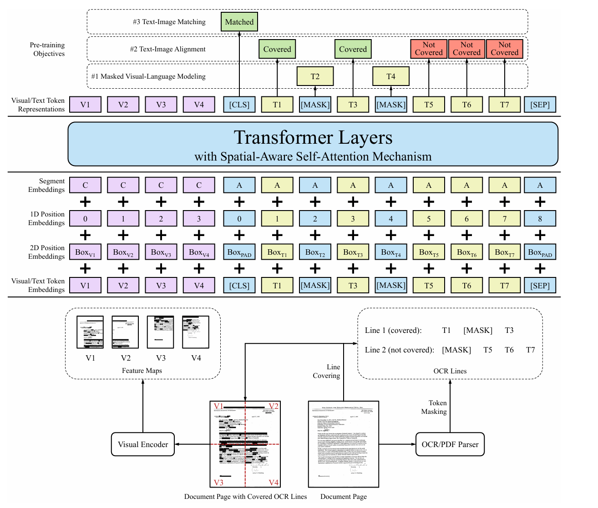

## DoClasiq

A document classification and data extraction Web App for company documents. Classification is done using a fine-tuned version of LayoutLMv2ForSequenceClassification from HuggingFace Transformers library. Rule-based structured data extraction is done using predefined configuration for each class of documents.

**Fine-tuned model is available on Hugging Face. no need to run training. just follow section 2 to run the app.**  

Dataset used: [Company Documents Dataset](https://www.kaggle.com/datasets/navodpeiris/company-documents-dataset)  

Fine-tuned model link: [navodPeiris/layoutlmv2-document-classifier](https://huggingface.co/navodPeiris/layoutlmv2-document-classifier)

Base model link: [microsoft/layoutlmv2-base-uncased](https://huggingface.co/microsoft/layoutlmv2-base-uncased)

#### Tech Stack: Python, Streamlit, FastAPI, Docker, Uvicorn, Gunicorn, Transformers, LayoutLMv2, pytesseract, PyMuPDF, Kaggle Datasets, Tensorboard

- Python: language used for both UI and API
- Streamlit: framework to build Web UI
- FastAPI: API framework
- Docker: cross platform usage, hassle-free deployment and testing
- Uvicorn: as Asynchronous server for FastAPI app
- Gunicorn: for running multiple Uvicorn workers for parallelism
- Transformers: Hugging Face transformers used for fine-tuning LayoutLMv2
- LayoutLMv2: a multimodal transformer model for document classification using text, layout (position and spatial structure), and visual features from the document image
- pytesseract: used within LayoutLMv2 for OCR
- PyMuPDF: OCR for document data extraction in API after inference
- Kaggle Datasets: used to load dataset in Kaggle notebook
- Tensorboard: used for logging training metrics like train_loss, train_accuracy, eval_loss, eval_accuracy

#### Dataset Description

This dataset contains a collection of over 2,000 company documents.  

There are 5 categories:  

- inventory_monthly: monthly inventory summary for set of categories  
- inventory_monthly_category: monthly inventory summary focusing a specific category  
- invoices: invoices of company  
- purchase_orders: purchase orders received  
- shipping_orders: shipping orders received  

### 1. Training (optional)

#### Run training:
Run this kaggle notebook (use P100 gpu not T4x2): [finetune_doclasiq_model](https://www.kaggle.com/code/navodpeiris/finetune-doclasiq-model)

Note: don't run the last cell unless you are pushing to a Hugging Face repo. If pushing to a Hugging Face repo set repo_id and token on TrainingArguments correctly.

#### Visualize training details of my run (loss, accuracy etc):
```
pip install tensorboard
cd train
tensorboard --logdir logs
```

### 2. Run the app
- Run Docker Desktop App
- Run following command in project root folder
```
docker-compose up -d .
```

This will download the pre-built images and start the UI and APIs.

### 3. How to use the app

Use test documents in test_docs folder to test  


### 4. Performance

Model Performance:


Model has acheived **0.0008 evaluation loss** and **1.0 evaluation accuracy**

### 5. Design choices

#### Why streamlit for UI?

Streamlit is easy to use and integrate well with any python workload related to ML.

#### Why use FastAPI with Uvicorn and Gunicorn 

FastAPI is high-performance framework for API development and widely used.  
Gunicorn handles multiple worker processes, restarts.  
Uvicorn enables FastAPI’s async features as it is an async web server.  

```
CMD ["gunicorn", "-w", "4", "-k", "uvicorn.workers.UvicornWorker", "-b", "0.0.0.0:8001", "api:app"]
```

This command plugs Uvicorn into Gunicorn as a worker and here it spawns 4 workers to handle requests parallely. This is great for scalability.

#### Why Docker?

It makes running this solution easy and seamless. works perfectly across platforms. Multi-stage docker builds were used to reduce Image size.

### 6. How document classification work

Model used for classification is LayoutLMv2.



LayoutLMv2 performs document classification by jointly encoding the text content, layout structure, and visual appearance of a document. First, it extracts words using tesseract OCR engine and embeds each token along with its bounding box coordinates. Then, visual features are extracted from the entire image using a convolutional neural network and fused with the token embeddings. This fusion allows the model to understand not only what is written, but where it is written and how it appears, capturing the document’s structure. The combined embeddings are passed through a multimodal Transformer that models the interactions among tokens, their spatial layout, and visual context. For classification tasks (e.g., invoice vs. receipt), a [CLS] token is used at the beginning of the sequence to aggregate information, and its final hidden state is passed through a classifier head to predict the document’s class. This makes LayoutLMv2 highly effective for real-world documents where text alone is insufficient due to layout dependencies.

I have fine-tuned LayoutLMv2 model on Company Documents Dataset and uploaded it to Hugging Face hub. Model is then downloaded and cached at doclasiq_api Docker Image build time. Model caching ensures fast start up of service. Model is loaded at FastAPI start up and served to incoming requests.

Model use the first page of the document for classifying it to a class as first page of a document is the key page that contain some header texts, layout that differentiate it from other documents. Naturally as humans, even we can classify a document by just looking at the first page.

#### Inference steps:
- First page of uploaded PDF document is converted to PIL image and sent to LayoutLMv2Processor which output encodings
- Returned encodings are sent to fine-tuned LayoutLMv2ForSequenceClassification model for classifying to a class

Note: LayoutLMv2Processor is the preprocessing tool used for preprocessing document to the required input format needed by LayoutLMv2ForSequenceClassification model. same preprocessing was followed during training.

entropy of softmax output is used to reject confidently wrong outputs for unrelated documents and always classify those unrelated documents as "unknown" type documents. Extraction is not performed for "unknown" documents.

### 7. How data extraction works

Data extraction is done using simple rule-based extraction of must-exist structures in each class of documents. This is using predefined configurations.

Example config:
```
invoice_config = {
    "structures": [
        {
            "structure_type": "text line",
            "starts_with": "Order ID",
            "next_starts_with": "Customer ID",
            "name": "order id",
            "type": "integer",
            "remove": "Order ID:",
            "ignore": False
        },
        {
            "structure_type": "text line",
            "starts_with": "Customer ID",
            "next_starts_with": "Order Date",
            "name": "customer id",
            "type": "string",
            "remove": "Customer ID:",
            "ignore": False
        },
        {
            "structure_type": "text line",
            "starts_with": "Order Date",
            "next_starts_with": "Customer Details:",
            "name": "order date",
            "type": "string",
            "remove": "Order Date:",
            "ignore": False
        },
        {
            "structure_type": "text line",
            "starts_with": "Customer Details:",
            "next_starts_with": "Contact Name:",
            "name": "customer details heading",
            "type": "string",
            "remove": "",
            "ignore": True
        },
        {
            "structure_type": "key-value table",
            "starts_with": "Contact Name:",
            "next_starts_with": "Product Details:",    # starting text of next item (empty means no next item)
            "name": "Customer Details",
            "num_of_keys": 7,
            "keys": [
                {"name": "Contact Name", "type": "string", "remove": ""},
                {"name": "Address", "type": "string", "remove": ""},
                {"name": "City", "type": "string", "remove": ""},
                {"name": "Postal Code", "type": "integer", "remove": ""},
                {"name": "Country", "type": "string", "remove": ""},
                {"name": "Phone", "type": "string", "remove": ""},
                {"name": "Fax", "type": "string", "remove": ""}
            ],
        },
        {
            "structure_type": "text line",
            "starts_with": "Product Details:",
            "next_starts_with": "Product ID",
            "name": "product details heading",
            "type": "string",
            "remove": "",
            "ignore": True
        },
        {
            "structure_type": "table",
            "starts_with": "Product ID",
            "next_starts_with": "TotalPrice",    # starting text of next item (empty means no next item)
            "name": "Product Details Table",
            "columns": 4,
            "headers": ["Product ID", "Product Name", "Quantity", "Unit Price"],
            "fields": [
                {"name": "Product ID", "type": "integer", "remove": ""},
                {"name": "Product Name", "type": "string", "remove": ""},
                {"name": "Quantity", "type": "integer", "remove": ""},
                {"name": "Unit Price", "type": "float", "remove": ""}
            ],
        },
        {
            "structure_type": "table_summary",
            "starts_with": "TotalPrice",
            "next_starts_with": "Page 1",    # starting text of next item (empty means no next item)
            "name": "Products Total Price",
            "type": "float",
            "remove": "",
        },
        {
            "structure_type": "text line",
            "starts_with": "Page 1",
            "next_starts_with": "",
            "name": "page number",
            "type": "string",
            "remove": "",
            "ignore": True
        },
    ]
}
```

- structure type is used for understanding how to process the structure
- starts_with is used to detect start of the structure
- next_starts_with is used to detect when to move to next structure processing
- name is used for adding key field in dictionary
- type is used for parsing values with correct type
- remove is used for removal of part of string if needed
- ignore is used to ignore unimportant structures

#### How each structure type is processed

Note: even if a table row has items in save text line, pytesseract OCR returns them as seperate lines in sequence

- text line: process the current line and move to next structure
- key-value table: if current line is the key and then following line will contain value. This will run repeatedly from first key detection to ending key
- table: beginning lines are headers and they are ignored by default. next, each sequence of text lines equal to number of columns, are processed together as a record. For an example, if there are 4 columns, from beginning of table structure, process in batches where each batch has 4 lines corresponding to values of each column.
- table_summary: these are fields at bottom like total, average, mean etc. At beginning of structure we find the field name and following line is the value.